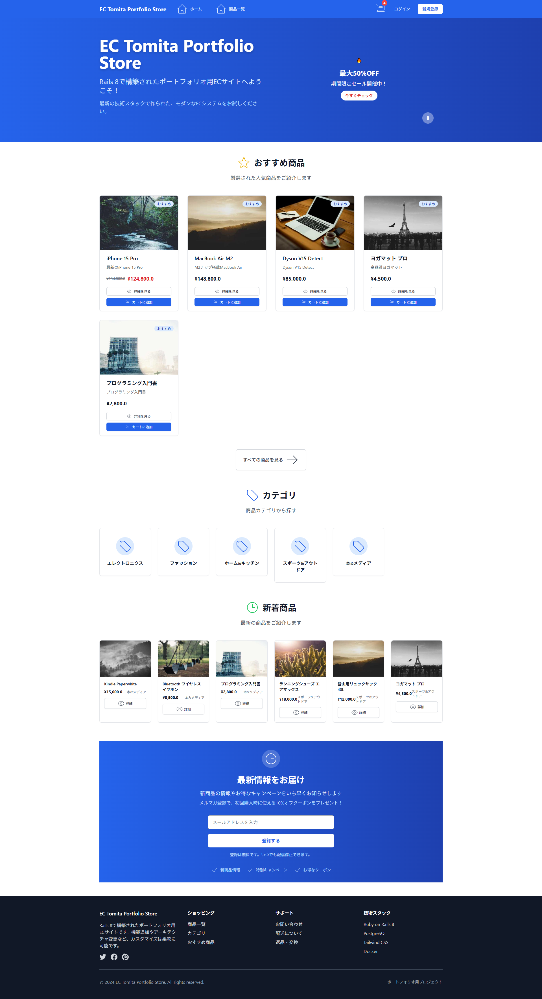
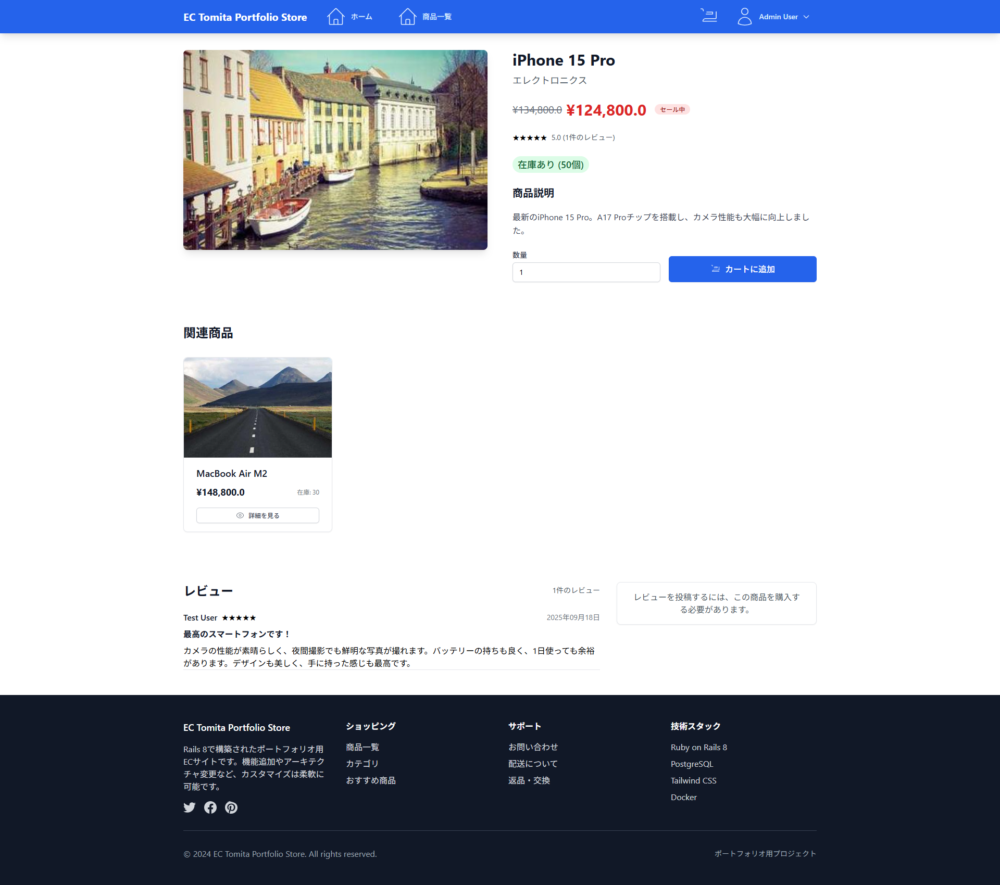
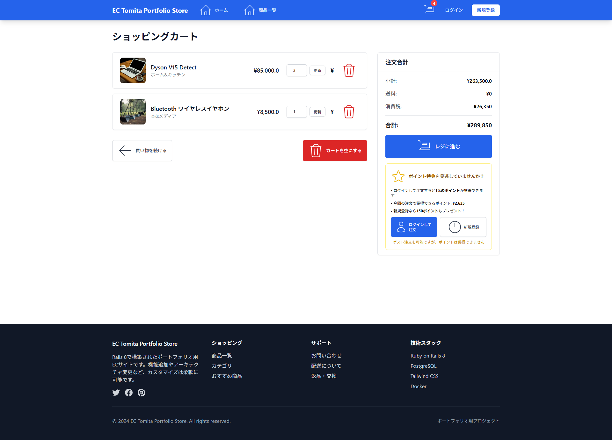
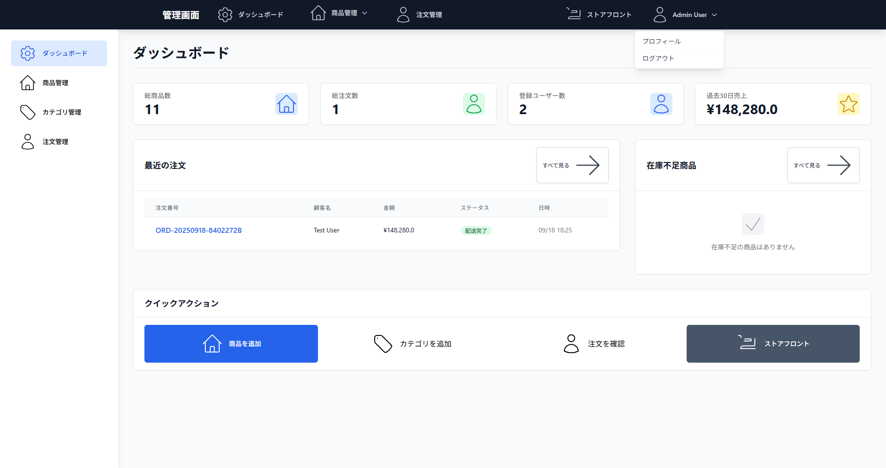

# EC Tomita Portfolio Store

Rails 8で構築されたポートフォリオ用ECシステムです。運用の手数が減る管理画面の他にも、ポイントシステムとゲスト注文機能など、マーケティング関連の機能も備えた、売れるモダンな高速のECサービスです。数々の拡張と、外部サービス連携、機能追加、エラー監視など、運用性・保守性を想定して対応しております。


## スクリーンショット

ストアフロント


商品詳細


カート画面


管理画面


## 技術スタック

- **Ruby on Rails 8.0.2**
- **PostgreSQL 15**
- **Tailwind CSS** (スタイリング)
- **Docker & Docker Compose**
- **Redis**
- **Devise** (認証)
- **Kaminari** (ページネーション)
- **ridgepole** (スキーマ管理)
- **Stimulus** (JavaScriptフレームワーク)

## 機能

### 基本機能
- ユーザー認証・登録
- 商品管理（CRUD）
- カテゴリ管理
- ショッピングカート
- 注文管理
- 在庫管理
- 検索・フィルタリング
- レスポンシブデザイン

### ポイントシステム
- 新規登録時に150ポイントをプレゼント
- 注文時に購入金額の1%のポイントを獲得
- ポイント履歴の管理
- ログイン促進のためのポイントアピール

### 注文機能
- ログインユーザー向けの通常注文
- ゲスト注文（ログインなしでの注文）
- セッションベースのカート管理
- 注文履歴の確認

### UI/UX機能
- ニュースレター購読セクション
- 商品カルーセル（ホームページ）
- ポイント特典の案内表示
- ログイン促進の導線強化

## セットアップ

### Docker Composeを使用（推奨）

1. リポジトリをクローン
```bash
git clone <repository-url>
cd ec_fullscratch_on_rails_portfolio
```

2. 環境変数を設定（オプション）
```bash
# .env_sampleファイルをコピーして.envファイルを作成
cp .env_sample .env

# 必要に応じて.envファイルを編集
# デフォルトの設定でDocker Composeを使用する場合はこの手順は不要
```

3. 初回セットアップを実行
```bash
make setup
# または
./bin/docker-setup
```

4. アプリケーションにアクセス
- アプリケーション: http://localhost:3000
- データベース: localhost:5432
- Redis: localhost:6379

### プロジェクト構造

```
ec_fullscratch_on_rails_portfolio/
├── docker/                    # Docker関連ファイル
│   ├── docker-compose.yml    # 開発環境用Docker Compose設定
│   ├── Dockerfile.dev        # 開発環境用Dockerfile
│   ├── init.sql              # PostgreSQL初期化スクリプト
│   └── .dockerignore         # Docker用.gitignore
├── app/                      # Railsアプリケーション
├── config/                   # 設定ファイル
├── db/                       # データベース関連
└── docker-compose.yml        # メインのDocker Compose設定
```

### 手動セットアップ

1. 依存関係をインストール
```bash
bundle install
yarn install
```

2. データベースをセットアップ
```bash
bundle exec ridgepole -c config/database.yml -E development --apply -f db/Schemafile.rb
bundle exec rails db:seed
```

3. アプリケーションを起動
```bash
rails server
```

## 便利なコマンド

```bash
# すべてのサービスを起動
make up

# アプリケーションのログを表示
make logs

# アプリケーションコンテナに入る
make shell

# データベースコンテナに入る
make db-shell

# アプリケーションを再起動
make restart

# すべてのコンテナを停止
make down

# データベースマイグレーション
make migrate

# シードデータを投入
make seed

# Railsコンソールを起動
make console

# テストを実行
make test
```

## 環境変数

このプロジェクトでは`dotenv-rails` gemを使用して環境変数を管理しています。

### 環境変数の設定

1. `.env_sample`ファイルをコピーして`.env`ファイルを作成
```bash
cp .env_sample .env
```

2. `.env`ファイルを編集して、実際の値を設定
```bash
# データベース設定
DB_HOST=localhost
DB_PORT=5432
DB_NAME=ec_fullscratch_on_rails_portfolio_development
DB_USERNAME=postgres
DB_PASSWORD=your_password

# その他の設定...
```

### 主要な環境変数

| 変数名 | 説明 | デフォルト値 |
|--------|------|-------------|
| `DB_HOST` | データベースホスト | `db` |
| `DB_PORT` | データベースポート | `5432` |
| `DB_NAME` | データベース名 | `ec_fullscratch_on_rails_portfolio_development` |
| `DB_USERNAME` | データベースユーザー名 | `postgres` |
| `DB_PASSWORD` | データベースパスワード | `password` |
| `REDIS_URL` | Redis URL | `redis://redis:6379/0` |
| `APP_NAME` | アプリケーション名 | `EC Tomita Portfolio Store` |
| `APP_URL` | アプリケーションURL | `http://localhost:3000` |

## テスト用アカウント

- 管理者: `admin@example.com` / `password123`
- 一般ユーザー: `user@example.com` / `password123`

## ポイントシステム仕様

### ポイント獲得方法
- **新規登録**: 150ポイントをプレゼント
- **注文時**: 購入金額の1%のポイントを獲得
- **ゲスト注文**: ポイントは獲得できません

### ポイント表示
- カート画面で獲得予定ポイントを表示
- ログイン画面・新規登録画面でポイント特典をアピール
- ユーザーの現在のポイント残高を表示

## 注文システム仕様

### ログインユーザー
- 通常の注文フロー
- ポイント獲得
- 注文履歴の確認
- プロフィール情報の自動入力

### ゲストユーザー
- ログインなしでの注文
- ゲスト用の注文フォーム
- セッションベースのカート管理
- ポイントは獲得できない

## 主要な画面・機能

### ホームページ
- 商品カルーセル（フィーチャー商品）
- ニュースレター購読セクション
- カテゴリ別商品表示

### 商品一覧・詳細
- 商品検索・フィルタリング
- カテゴリ別絞り込み
- 商品詳細表示
- カートへの追加機能

### カート・注文
- カート内容の確認・編集
- ポイント特典の案内
- ログイン促進の導線
- ゲスト注文対応

### ユーザー認証
- ログイン・新規登録
- ポイント特典のアピール
- プロフィール管理

## 開発環境

開発環境では以下のサービスが利用できます：

- **Rails アプリケーション**: http://localhost:3000
- **PostgreSQL**: localhost:5432
- **Redis**: localhost:6379

## 本番環境

本番環境ではKamalを使用してデプロイできます：

```bash
kamal setup
kamal deploy
```

## お問い合わせ

機能追加やアーキテクチャ変更など、カスタマイズは柔軟に可能です。
お問い合わせください。

## ライセンス

MIT License
